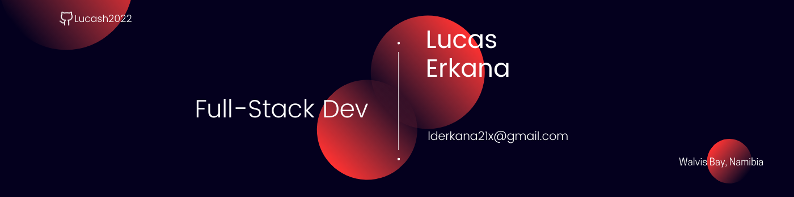

  
  

 
<h1 align='center' style = 'margin-top:50px'>𝐇𝐞𝐥𝐥𝐨  I'm Lucas Erkana</h1>

- 🔭 I’m currently working on [BoxFlix-Backend](https://github.com/Lucash2022/BookFlix-Backend) and [BoxFlix-Frontend](https://github.com/Lucash2022/BookFlix-Frontend)
- 🔭 Live demo [BoxFlix](#)
- 👨‍💻 All of my projects are available are [here](https://github.com/Lucash2022?tab=repositories)
- 👀 I’m interested in Software development
- 🌱 I’m Full-Stack Developer
- 💞️ I’m looking to collaborate on different projects
- 📫 Contact me by [Email](lederkana21x@gmail.com)
- 📫 Contact me by [Linkedin](https://www.linkedin.com/in/lucas-erkana/)
- 📫 Read my blogs on [medium](https://medium.com/@lderkana21x)
- 📫 How to reach me **Lderkana21x@gmail.com**

  
<h3 align="left">Connect with me:</h3>

<h3 align="left">Languages and Tools:</h3>

     
      
   <a href="https://webpack.js.org" target="_blank" rel="noreferrer"> 
 <a href="https://babeljs.io/" target="_blank" rel="noreferrer">                  

&nbsp;

